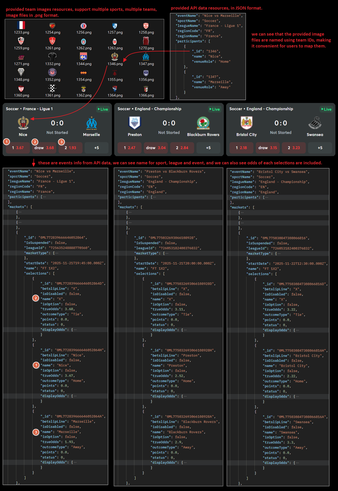

## Intro

This API only has two methods, /getevents returns events, markets, and selections info. Event info includes event name, participants/team names, event start time, and other fields. For market info we provide main markets (for example: soccer we provide HDP, OU, 1x2; basketball we provide spread, OU, moneyline). For selection info we provide four kinds of odds styles and points. All returned fields are explained in this document.



## getevents

URL: \[POST] <https://bti-odds.bsports.asia/api/SportsDataAPI/getevents>
Note: POST data only supports JSON format.

#### Query Parameters

| Parameter   | Data Type | Description                                                                                                        | Required |
| ----------- | --------- | ------------------------------------------------------------------------------------------------------------------ | -------- |
| pKey        | String    | Permission key, will be provided by BTi.                                                                           | Required |
| sportID     | String    | Sport ID filter. Sport id list will be provided at the end of this doc.                                            | Required |
| isLive      | string    | Specific to pull live or pre-match events.                                                                         | Required |
| eventType   | String    | Available values: Fixture, Outright.                                                                               | Required |
| take        | String    | Take how many events.                                                                                              | Required |
| skip        | String    | Skip how many events.                                                                                              | Required |
| locale      | String    | Specify the response language, 2 letters locale code.                                                              | Required |
| leagueID    | String    | League ID filter, filter on certain league.                                                                        | Optional |
| eventID     | String    | Event ID filter, return the specific event.                                                                        | Optional |
| isTopLeague | String    | Specific to pull isTopLeague events. Indicates whether the event is considered a popular league as defined by BTi. | Optional |

#### Request sample



```json
{
  "pKey": "1234567890",
  "sportID": "1",
  "isLive": "false",
  "eventType": "fixture",
  "take": "10",
  "skip": "0",
  "locale": "en",
  "leagueID": "", 
  "eventID": "", 
  "isTopLeague": ""
}
```



This is a request sample to pull 10 pre-match versus-type soccer events, returned in English.

* sportID = 1 means soccer.
* isLive = false means pre-match.
* eventType = fixture means versus type of events (not outright).
* take = 10 means a maximum of 10 events returned.
* skip = 0 means return from the first row.
* locale = en means English response.
* leagueID and eventID are optional filters.

#### Response Fields explanation

events object

| Field                   | Description                                                                                                                         |
| ----------------------- | ----------------------------------------------------------------------------------------------------------------------------------- |
| \_id                    | This is the ID of the event.                                                                                                        |
| IsLive                  | Specifies if this event is currently running.                                                                                       |
| IsSuspended             | Specifies if this event is temporarily suspended.                                                                                   |
| IsTopLeague             | Specifies if this event is in a top league (defined by BTi).                                                                        |
| LeagueId                | This is the ID of the league.                                                                                                       |
| MasterLeagueId          | Master ID of the league. League ID may change by season; MasterLeagueId remains constant and can be used for mapping league images. |
| SportId                 | This is the ID of the sport.                                                                                                        |
| StartEventDate          | Event start datetime.                                                                                                               |
| Status                  | Event status. Possible values: NotStarted = 0, InProgress = 1                                                                       |
| TotalActiveMarketsCount | Total number of markets.                                                                                                            |
| Type                    | Type of the event. Possible values: Fixture, OutRight.                                                                              |
| EventName               | Name of the event.                                                                                                                  |
| BetslipLine             | Same as EventName (display name for betslip).                                                                                       |
| SportName               | Name of the sport.                                                                                                                  |
| LeagueName              | Name of the league.                                                                                                                 |
| regionCode              | Region code of the event.                                                                                                           |
| regionName              | Region name of the event.                                                                                                           |

Participants object

| Field     | Description                           |
| --------- | ------------------------------------- |
| \_id      | Team ID.                              |
| Name      | Team name.                            |
| VenueRole | Team's venue role (e.g., Home, Away). |

Score object

| Field     | Description              |
| --------- | ------------------------ |
| AwayScore | Score for the away team. |
| HomeScore | Score for the home team. |

Markets object

| Field       | Description                                        |
| ----------- | -------------------------------------------------- |
| \_id        | ID of the market.                                  |
| IsSuspended | Specifies if this market is temporarily suspended. |
| LeagueId    | League ID associated with the market.              |
| StartDate   | Event start datetime.                              |
| Name        | Name of the market.                                |

MarketType object

| Field | Description               |
| ----- | ------------------------- |
| \_id  | ID of this market type.   |
| Name  | Name of this market type. |

Selections object

| Field       | Description                                                                                                        |
| ----------- | ------------------------------------------------------------------------------------------------------------------ |
| \_id        | ID of the selection.                                                                                               |
| BetslipLine | Selection display name for betslip.                                                                                |
| IsDisabled  | Specifies if this selection is available or not.                                                                   |
| Name        | Name of the selection.                                                                                             |
| IsOption    | Specifies if this selection is optional or main. BTi sets points; selections with main points are main selections. |
| TrueOdds    | True odds of the selection (also in decimal).                                                                      |
| OutcomeType | For UI reference. Possible values: Over/Under, Home/Away/Tie.                                                      |
| Points      | Points of the selection.                                                                                           |
| Status      | Selection status. Possible values: NotStarted = 0, InProgress = 1                                                  |

DisplayOdds object

| Field   | Description                                                        |
| ------- | ------------------------------------------------------------------ |
| Decimal | Odds in decimal / European format (also the format for true odds). |
| HK      | Odds in Hong Kong format.                                          |
| Indo    | Odds in Indo format.                                               |
| Malay   | Odds in Malay format.                                              |

> **💡 Implementation Reference:**
> To see how to securely assemble these Query Parameters (especially the `pKey`) and initiate a POST request, please refer to the backend examples in this repository. For instance, Node.js developers can check the `BackendNodeJS/` directory; C# developers can check `BackendCSharp/`. To understand how to render the returned Events, Markets, and Selections to the UI, please review the frontend implementation in the `frontend/` directory.